# Architecture & parcours utilisateurs — Nautilus

> Document d'architecture des parcours utilisateurs.
> Diagrammes au format **Mermaid** (rendus nativement par GitHub + VSCode avec l'extension "Markdown Preview Mermaid Support").
>
> 🎯 **Périmètre** : **moteurs hors-bord** (spécialité de l'auteur, ex-mécanicien nautique).

---

## 🗺️ Sitemap macro — vue d'ensemble

Vue d'ensemble des routes de l'application, regroupées par rôle.

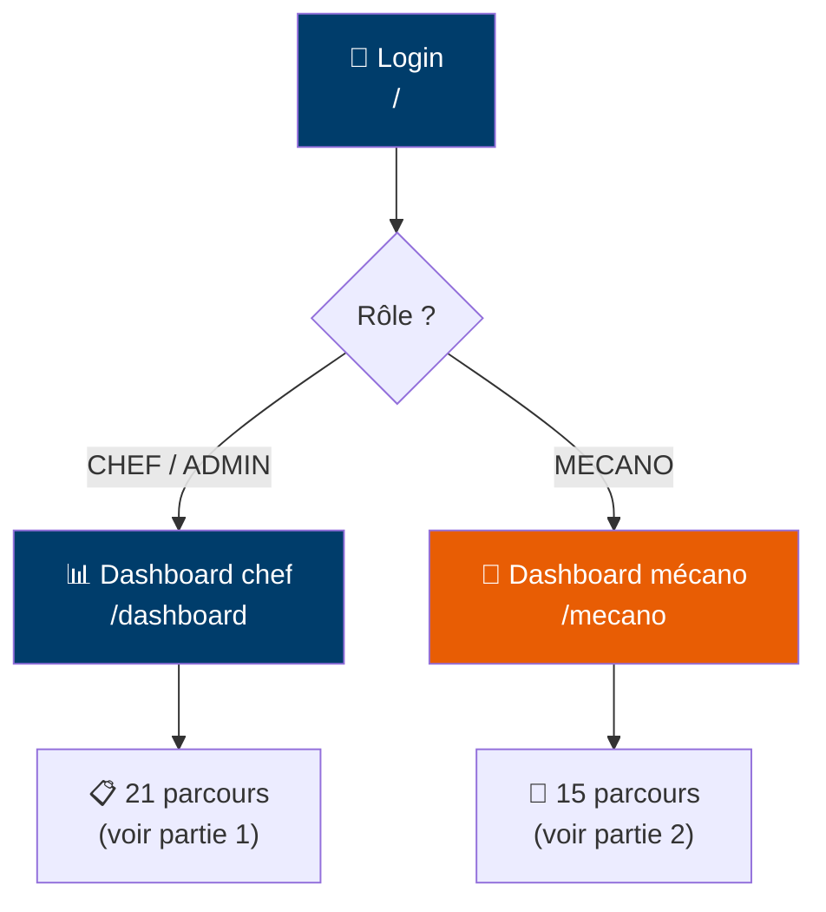

---

# 📋 PARTIE 1 — PARCOURS CHEF D'ATELIER

> Contexte d'usage : **desktop-first** (bureau / comptoir) avec déclinaison mobile pour les déplacements.
> Sidebar à gauche, grille multi-colonnes, tableaux denses possibles.

## 1.1 Sitemap chef

```mermaid
graph TD
    Dashboard["📊 Dashboard chef<br/>/dashboard"]

    Dashboard --> Entrees["🎯 Entrées principales"]
    Dashboard --> Referentiel["📚 Référentiel"]
    Dashboard --> Workflow["🔄 Workflow vente"]
    Dashboard --> Operations["🔧 Opérations"]
    Dashboard --> Suivi["📈 Suivi & finance"]
    Dashboard --> Saison["🍂 Campagnes saison"]
    Dashboard --> Admin["⚙️ Administration"]

    Entrees --> E1["📷 Scan plaque<br/>/scan-plaque"]
    Entrees --> E2["🔍 Recherche<br/>/recherche"]
    Entrees --> E3["⛵ Fiche bateau<br/>/bateau/:id"]

    Referentiel --> R1["👥 Clients<br/>/clients"]
    Referentiel --> R2["⛵ Bateaux<br/>/bateaux"]
    Referentiel --> R3["🛡 Sécurité bateau<br/>/bateaux/:id/securite"]

    Workflow --> W1["📋 Devis<br/>/devis"]
    Workflow --> W2["🧾 Factures<br/>/factures"]

    Operations --> O1["🔧 OR<br/>/or"]
    Operations --> O2["🚨 Dispatch urgences<br/>/or/dispatch"]
    Operations --> O3["📅 Planning équipe<br/>/planning"]
    Operations --> O4["📞 Appels entrants<br/>/appels"]

    Suivi --> S1["📦 Stock pièces<br/>/stock"]
    Suivi --> S2["🛡 Garanties<br/>/garanties"]
    Suivi --> S3["📋 Expertises<br/>/expertises"]
    Suivi --> S4["📊 Stats avancées<br/>/stats"]

    Saison --> SA1["🍂 Hivernage<br/>/saisonnier/hivernage"]
    Saison --> SA2["🌷 Déshivernage<br/>/saisonnier/deshivernage"]
    Saison --> SA3["📅 Prévisionnel sécu<br/>/saisonnier/securite-previsionnel"]

    Admin --> AD1["👷 Équipe<br/>/equipe"]
    Admin --> AD2["✅ Checklists<br/>/parametres/checklists"]
    Admin --> AD3["🏭 Constructeurs<br/>/parametres/constructeurs"]
    Admin --> AD4["👤 Mon profil<br/>/parametres/profil"]

    style Dashboard fill:#003D6B,color:#fff
    style Entrees fill:#E85D04,color:#fff
    style Referentiel fill:#0066B3,color:#fff
    style Workflow fill:#0066B3,color:#fff
    style Operations fill:#0066B3,color:#fff
    style Suivi fill:#0066B3,color:#fff
    style Saison fill:#0066B3,color:#fff
    style Admin fill:#0066B3,color:#fff
```

## 1.2 Les 5 parcours cœur du chef d'atelier

Ceux qui couvrent ~80% du quotidien.

| Code | Parcours | Fréquence |
|---|---|---|
| **A1** | Accueillir un client → composer un devis | quotidien |
| **B1** | Créer un OR depuis un devis accepté | quotidien |
| **B3** | Gérer un appel d'urgence entrant | hebdo |
| **B4** | Dispatcher les urgences en attente | quotidien (matin) |
| **C1** | Suivre les OR en cours | quotidien (matin + soir) |

### A1 · Accueillir un client → composer un devis

> Le parcours phare. Inclut le scan plaque, la composition d'intervention, l'envoi mail.

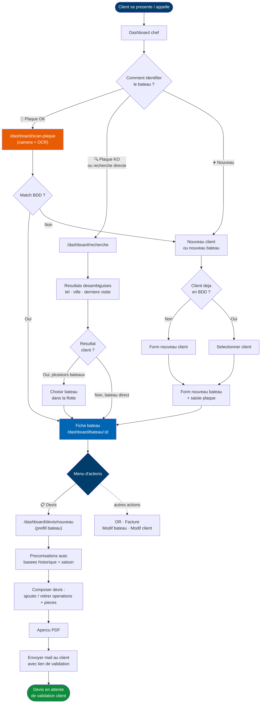

### B1 · Créer un OR depuis un devis accepté

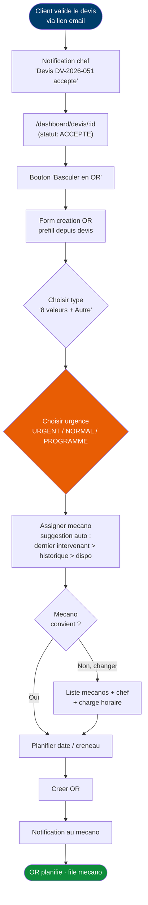

### B3 · Gérer un appel d'urgence entrant

> ⚠️ Spécificité métier : le client appelle **au téléphone**, pas via l'app.
> → Identification par **recherche texte** (nom bateau / nom client / tel).
>
> 🎯 **Rôle du chef pendant l'appel** :
> 1. **Diagnostiquer si possible par téléphone** (questions précises selon symptômes)
> 2. **Consulter l'historique** des dernières interventions
> 3. **Préparer le briefing mécano** avec matériel adapté (pièces + outils)
>
> 🔑 **Infos critiques à capturer pour le mécano** : lieu du bateau + accès aux clés + téléphone client + diagnostic présumé + pièces à emporter.

```mermaid
flowchart TD
    Start([Tel sonne<br/>client en panne]) --> Recevoir["Chef décroche<br/>écoute le client"]
    Recevoir --> Identif["Identifier le bateau<br/>recherche manuelle :<br/>nom bateau / client / tel"]

    Identif --> Trouve{Bateau<br/>en BDD ?}
    Trouve -->|Oui| ConsHisto["Consulter historique :<br/>5 dernières interventions<br/>pièces récentes &lt; 12 mois<br/>pannes similaires passées"]
    Trouve -->|Non| New["Saisir client + bateau<br/>en vol : nom + tel + bateau"]
    New --> ConsHisto

    ConsHisto --> Diag["Chef diagnostique par téléphone<br/>'questions ciblées au client'"]
    Diag --> Resolution{Résolu<br/>au téléphone ?}

    Resolution -->|"✅ Oui (renseignement)"| LogClose["Logger appel<br/>+ note résumé<br/>+ clôturer"]
    Resolution -->|"❌ Non — intervention"| Capture["📋 Capturer infos urgence :<br/>- 📍 Lieu actuel bateau<br/>  port + ponton + GPS<br/>- 🔑 Accès aux clés<br/>- 📞 Téléphone client confirmé<br/>- 🔍 Diagnostic présumé chef<br/>- 🛠 Liste pièces à emporter<br/>- 🧰 Outils spécifiques"]

    Capture --> CreaOR["Créer OR<br/>type = Réparation ou Diagnostic<br/>+ flag URGENT"]
    CreaOR --> Choisi["Chef choisit le mécano<br/>pas de suggestion auto si urgent"]
    Choisi --> Brief["Briefing mécano mobile-first :<br/>localisation + clés + tel + diag<br/>+ pièces à emporter"]
    Brief --> NotifMeca["Notif mécano push<br/>'urgence à prendre'"]
    NotifMeca --> NotifClient["SMS client avec créneau<br/>+ identité du mécano"]
    NotifClient --> Send["Mécano part avec matériel adapté"]

    Send --> Verif{"Panne dans les<br/>8 semaines après<br/>mise à l'eau ?"}
    Verif -->|Oui| Flag["Flag 'Vigilance responsabilité atelier'<br/>→ suggère prise en charge gracieuse"]
    Verif -->|Non| End([OR urgent en cours])
    Flag --> End

    LogClose --> End2([Appel clôturé sans intervention])

    style Start fill:#C81E1E,color:#fff
    style Capture fill:#E85D04,color:#fff
    style Brief fill:#0066B3,color:#fff
    style End fill:#0E8C3A,color:#fff
    style End2 fill:#0E8C3A,color:#fff
    style Flag fill:#C81E1E,color:#fff
```

**📞 Apport copilote IA pendant l'appel** (gros gain de productivité) :

⚠️ **L'agent IA NE DIAGNOSTIQUE PAS** (voir [[feedback-nautilus-agent-ia-ne-diagnostique-pas]]). Le **chef** garde la maîtrise du diag (c'est son expertise), le **mécano** confirme sur place. L'agent fait du secrétariat factuel.

Ce que l'agent fait pendant l'appel :
- Sort instantanément la **fiche bateau + historique des OR livrées** (faits, pas hypothèses)
- **Enregistre les notes** que le chef tape/dicte au fil de l'eau
- Liste le **stock dispo** pour ce moteur (sur demande explicite du chef)
- Prépare l'**OR** quand le chef a tranché (type, urgence, mécano, lieu, clés, pièces saisies par le chef)
- Notifie le mécano + envoie le SMS client après validation

Ce que l'agent ne fait JAMAIS :
- ❌ Suggérer une cause de panne ("probablement démarreur")
- ❌ Suggérer des pièces à emporter sans demande explicite du chef
- ❌ Émettre des hypothèses mécaniques

**Règle "vigilance responsabilité atelier" — détaillée :**

- 🚫 **NE PAS** compter en "X jours après le dernier OR" (anti-métier — l'entretien est fait à l'hivernage en oct-nov, suivi de 4-6 mois de stockage)
- ✅ **Compter** à partir de la **date de mise à l'eau / déshivernage de l'année en cours** :
  - Si OR `DESHIVERNAGE` enregistré → on prend cette date comme référence
  - Sinon → fallback date par défaut (15 avril) — repère saisonnier
- ⏱ **Fenêtre de vigilance : 8 semaines (~2 mois)** après mise à l'eau
- 🎯 **Pourquoi 8 semaines ?** C'est la zone où une panne peut raisonnablement être imputée à un défaut d'entretien lors de l'hivernage précédent (pièce non vue / non changée qui lâche en début de saison)
- 🧠 **Décision finale humaine** : le système signale, le chef décide (prise en charge gracieuse, geste commercial, ou pas)

### B4 · Dispatcher les urgences en attente (FIFO)

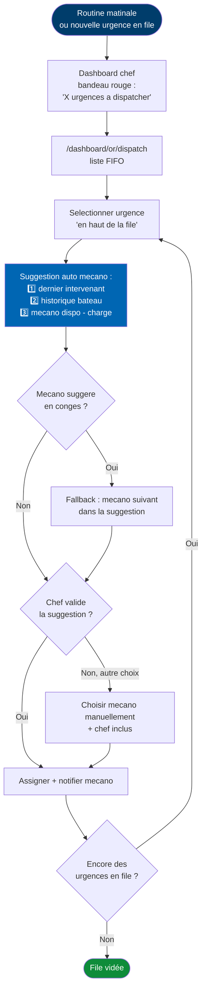

### C1 · Suivre les OR en cours

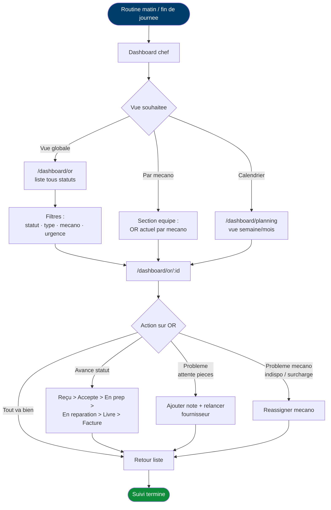

## 1.3 Les 16 autres parcours chef à dérouler

Liste par catégorie — diagrammes Mermaid à compléter au fur et à mesure.

### 🤝 Accueil & vente
- **A2** · Facturer un achat comptoir

### 🔧 Création & dispatch OR
- **B2** · Créer un OR direct (sans devis préalable)

### 📋 Suivi opérationnel
- **C2** · Suivre la charge de l'équipe — **détaillé ci-dessous** (planning dynamique)
- **C3** · Consulter le résumé d'un bateau

#### C2 · Suivre la charge équipe + planning dynamique

> 📅 **Le planning n'est pas figé** : il se réorganise automatiquement quand un OR change de statut.
> L'algorithme classique gère les décisions, un LLM (Claude API) explique chaque décision en langage naturel pour que le chef comprenne sans intervenir.

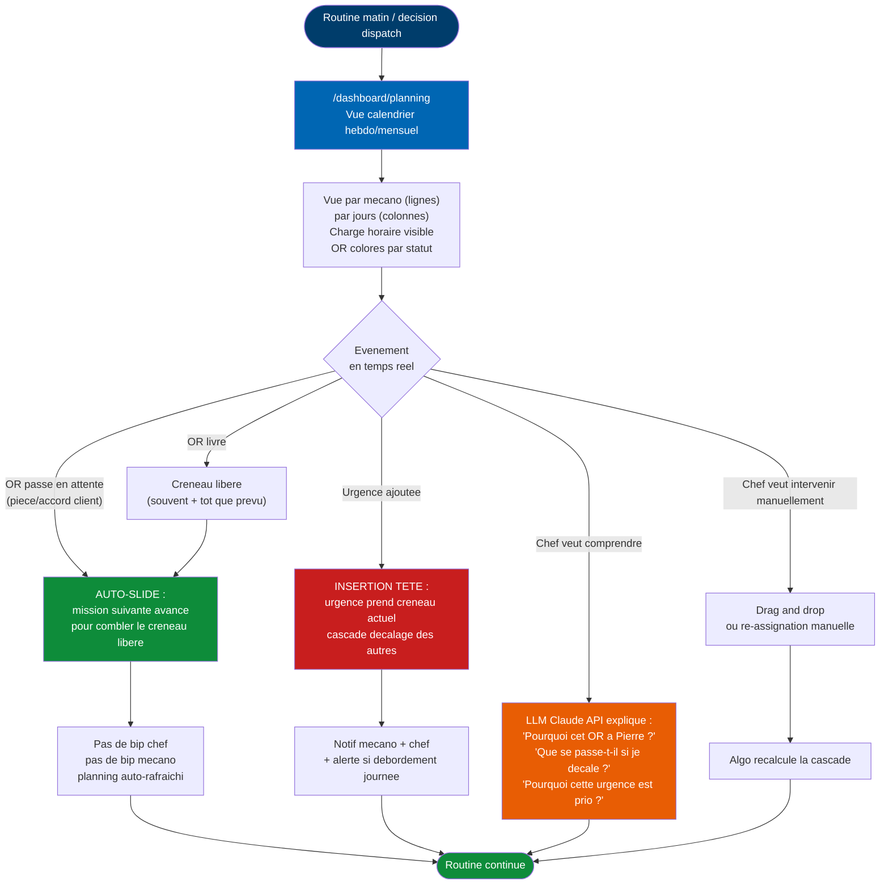

**🧠 Stack technique (pour le Dossier de Projet jury) :**

| Composant | Tech | Couverture compétences |
|---|---|---|
| **Algorithme de scheduling** | Service NestJS (TS) avec règles métier | BC02-#7 (composant métier serveur) |
| **Estimation durée OR** | Table de référence + ajustement historique (SQL) | BC02-#5/#6 |
| **Auto-slide / cascade** | Service NestJS déclenché par event Prisma | BC02-#7 |
| **LLM explicatif** | Claude API (Anthropic SDK) | **Bonus certifs IA Studi Front + Back** |
| **Vue calendrier** | React + lib calendar (FullCalendar ou custom shadcn) | BC01-#4 (dynamique) |
| **Drag & drop** | React DnD ou Sortable.js | BC01-#4 (dynamique riche) |

**📊 Layout type vue planning (desktop) :**

```
┌─────────────────────────────────────────────────────────────┐
│ Planning équipe · Semaine du 27 mai - 2 juin                │
│ [< Semaine prec.] [📅 Cette sem.] [Semaine suiv. >]         │
├─────────────────────────────────────────────────────────────┤
│        │ Lun 27 │ Mar 28 │ Mer 29 │ Jeu 30 │ Ven 31 │       │
├─────────────────────────────────────────────────────────────┤
│ Pierre │ 🚨URG  │ Entret │ Hivern │ ⏸Pause │ Diag   │       │
│        │ OR-201 │ OR-202 │ OR-203 │ OR-204 │ OR-205 │       │
│        │  8h    │  5h    │  6h    │ attente│  4h    │       │
├─────────────────────────────────────────────────────────────┤
│ Marie  │ Entret │ Repar  │ Pose   │ Entret │ ❌ off │       │
│        │ OR-301 │ OR-302 │ OR-303 │ OR-304 │ conges │       │
│        │  5h    │  6h    │  3h    │  4h    │        │       │
├─────────────────────────────────────────────────────────────┤
│ Romain │ Hivern │ Hivern │ Garant │ Expert │ Repar  │       │
│ (chef) │ OR-401 │ OR-402 │ OR-403 │ OR-404 │ OR-405 │       │
├─────────────────────────────────────────────────────────────┤
│ 💡 "Pourquoi OR-201 est URG ?" → bouton "Expliquer" (LLM)   │
│ 💡 Conflit detecte : Pierre deborde de 1h jeudi (LLM aide)  │
└─────────────────────────────────────────────────────────────┘
```

Couleurs :
- 🟢 Vert : OR en cours / planifié OK
- 🔴 Rouge : URGENT
- 🟡 Jaune : En attente (pièce / accord)
- ⚫ Gris : Livré / Off
- 🟠 Orange : Conflit / débordement

### 💰 Facturation
- **D1** · Générer la facture d'un OR livré
- **D2** · Suivre les factures impayées

### 🍂 Campagnes saisonnières
- **E1** · Lancer la campagne Hivernage
- **E2** · Lancer la campagne Déshivernage
- **E3** · Piloter les commandes prévisionnelles sécurité

### 🛡 Garantie & expertise
- **F1** · Ouvrir une demande de garantie constructeur
- **F2** · Faire une expertise occasion

### 📦 Stock & approvisionnement
- **G1** · Réceptionner une commande pièces
- **G2** · Consulter les alertes stock bas

### 👥 Équipe & paramétrage
- **H1** · Gérer les comptes employés
- **H2** · Paramétrer les checklists métier
- **H3** · Consulter les stats avancées

---

# 🔧 PARTIE 2 — PARCOURS MÉCANICIEN

> Contexte d'usage : **mobile-first vrai** (terrain, bateau, ponton, atelier).
> Bottom nav, FAB pour le scan plaque, cards verticales, touch targets ≥ 56 px (mains gantées/sales/sel).

> ⚠️ **Hypothèses prises par défaut** (à valider/corriger par Romain) :
> - ✅ **Page principale mécano = son planning de la semaine** (tranché 2026-05-27)
> - 🟡 Le mécano peut **refuser** une urgence (avec motif) — le chef réassigne alors
> - 🟡 Pointage des heures **automatique** par les changements de statut (Démarré → Livré), pas de saisie manuelle d'heures
> - 🟡 Demande pièce supplémentaire : le mécano alerte le **chef**, qui contacte le client (pas de contact direct mécano↔client par défaut)
> - 🟡 Décompte pièces : **scan code-barre** quand dispo, **recherche texte** en fallback
> - 🟡 Accueil client (D3) : **tous les mécanos** peuvent recevoir un client si le chef est indispo (pas de hiérarchie senior/junior)

## 2.1 Sitemap mécano

> 🎯 **Page principale du mécano = son planning de la semaine** (pas un dashboard à widgets).
> Le mécano arrive sur l'app, il voit immédiatement ce qu'il a à faire sur les 7 prochains jours.

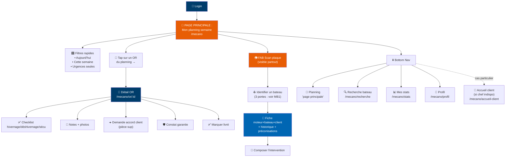

**Layout type page principale `/mecano` (mobile)** :

```
┌─────────────────────────────────────┐
│ 🔧 Nautilus       🔔  ☀️/🌙  RG   │  ← header sticky
├─────────────────────────────────────┤
│ [Aujourd'hui][Cette sem.][Urgent🚨]│  ← filtres rapides
├─────────────────────────────────────┤
│ 📅 Lundi 27 mai                    │
│   ┌───────────────────────────────┐ │
│   │ 09:00 · Le Mistral · Hivernage│ │  ← card OR
│   │ 🚨 URGENT                     │ │
│   └───────────────────────────────┘ │
│   ┌───────────────────────────────┐ │
│   │ 14:00 · Petit Bleu · Entretien│ │
│   └───────────────────────────────┘ │
│                                     │
│ 📅 Mardi 28 mai                    │
│   ┌───────────────────────────────┐ │
│   │ 10:00 · La Brise · Réparation │ │
│   └───────────────────────────────┘ │
│                                     │
│ 📅 Mercredi 29 mai                 │
│   '(rien planifié)                  │
│ ...                                 │
├─────────────────────────────────────┤
│ 📅 Planning · 🔍 · 📊 · 👤         │  ← bottom nav
└─────────────────────────────────────┘
                  📷                    ← FAB scan plaque
```

## 2.2 Les 4 parcours cœur du mécanicien

| Code | Parcours | Fréquence |
|---|---|---|
| **MB1** | Arriver sur un bateau → scanner la plaque → préparer l'intervention | quotidien (plusieurs fois/jour) |
| **MB3** | Intervenir sur une urgence assignée par le chef | hebdo |
| **MB2** | Exécuter un OR planifié avec checklist (hivernage/déshivernage/sécurité) | saisonnier intensif |
| **ME1** | Marquer un OR comme livré | quotidien |

### MB1 · Arriver sur un bateau → scanner la plaque → reprendre OU démarrer

> 🎯 **La valeur clé du scan plaque pour le mécano** : éviter le retour au bureau pour reprendre un OR en pause.
> Le mécano travaille en **multitâche** (plusieurs OR en parallèle, certains en attente de pièces ou d'accord client).
> Quand il revient sur un bateau, le scan plaque doit lui présenter en **premier** les **OR en cours sur ce bateau** (à reprendre), puis seulement après proposer une **nouvelle intervention**.
>
> Le parcours reprend les **3 voies d'identification** (comme le chef) : scan plaque · recherche manuelle (plaque illisible/inaccessible/bateau à l'eau) · création nouvelle (bateau jamais vu).

```mermaid
flowchart TD
    Start([Mécano arrive<br/>sur le bateau / ponton]) --> Sort[Sort son tel<br/>app déjà ouverte]
    Sort --> Choix{3 portes<br/>d'identification}

    Choix -->|"Plaque OK (majoritaire)"| Scan["FAB Scan plaque<br/>camera"]
    Choix -->|"Plaque KO ou inaccessible"| Recherche["Tab Recherche bateau<br/>/mecano/recherche"]
    Choix -->|"Bateau jamais vu"| New["Bouton Nouveau client et bateau"]

    Scan --> OCR["OCR Tesseract.js<br/>extrait texte plaque"]
    OCR --> Match{"Match BDD ?"}
    Match -->|"Oui"| Fiche["Fiche moteur + bateau + client"]
    Match -->|"Non / OCR illisible"| Fallback["Proposer fallback automatique"]
    Fallback --> Recherche

    Recherche --> Critere["Recherche par :<br/>- nom du bateau<br/>- nom du client<br/>- telephone"]
    Critere --> Result{"Resultats"}
    Result -->|"Bateau trouve"| Fiche
    Result -->|"Client trouve, N bateaux"| ChoixBat["Choisir bateau dans la flotte"]
    Result -->|"Rien trouve"| New
    ChoixBat --> Fiche

    New --> NewClient{"Client en BDD ?"}
    NewClient -->|"Non"| FormCli["Form nouveau client<br/>nom et tel obligatoires"]
    NewClient -->|"Oui"| SelectCli["Selectionner client existant"]
    FormCli --> FormBat["Form nouveau bateau<br/>nom obligatoire, plaque si visible"]
    SelectCli --> FormBat
    FormBat --> Fiche

    Fiche --> ORCheck{"OR en cours<br/>sur ce bateau ?"}

    ORCheck -->|"Oui (1 ou plusieurs)"| Reprendre["Liste OR en cours en haut :<br/>- OR-XXX statut En attente piece<br/>- OR-YYY statut En attente accord client<br/>- OR-ZZZ statut En reparation"]
    ORCheck -->|"Non"| Affiche

    Reprendre --> Choix2{"Choix mecano"}
    Choix2 -->|"Reprendre un OR existant"| Resume["Ouvrir l'OR<br/>continuer le travail<br/>SANS retour bureau"]
    Choix2 -->|"Demarrer nouvelle intervention"| Affiche

    Affiche["Affichage complet :<br/>- Historique 5 dernieres interventions<br/>- Preconisations auto<br/>- Heures moteur connues<br/>- Securite (peremption)<br/>- Liste pieces necessaires"]

    Affiche --> Compose{"Composer l'intervention"}
    Compose -->|"Ajouter"| Add1["Ajouter operation ou piece"]
    Compose -->|"Retirer"| Remove["Retirer du panier"]
    Compose -->|"Valider"| Valid["Valider la composition"]
    Add1 --> Compose
    Remove --> Compose

    Valid --> Action{"Action finale"}
    Action -->|"Creer OR direct"| NewOR["Creer OR<br/>mecano = origine"]
    Action -->|"Devis d'abord"| NewDevis["Creer devis<br/>envoyer mail client"]
    Action -->|"Facture comptoir"| NewFac["Facture directe<br/>sans OR"]

    Resume --> EndResume([Reprise OR en cours])
    NewOR --> End([Intervention démarrée])
    NewDevis --> End2([Devis envoyé client])
    NewFac --> End3([Facture émise])

    style Start fill:#E85D04,color:#fff
    style Scan fill:#E85D04,color:#fff
    style Recherche fill:#0066B3,color:#fff
    style New fill:#003D6B,color:#fff
    style Fiche fill:#0066B3,color:#fff
    style ORCheck fill:#E85D04,color:#fff
    style Reprendre fill:#0066B3,color:#fff
    style Resume fill:#0E8C3A,color:#fff
    style EndResume fill:#0E8C3A,color:#fff
    style End fill:#0E8C3A,color:#fff
    style End2 fill:#0E8C3A,color:#fff
    style End3 fill:#0E8C3A,color:#fff
```

**🎯 Layout type écran post-scan (mobile, mécano) :**

```
┌────────────────────────────────────────┐
│  ← Plaque identifiée                    │
│  🔧 Suzuki DF150 · 1245h                │
│  ⛵ Le Mistral · Pierre Martin          │
├────────────────────────────────────────┤
│  📋 OR EN COURS (2)              ⬆ TOP │
│  ┌──────────────────────────────────┐  │
│  │ ▶ OR-0142 · Entretien moteur     │  │
│  │   ⏸ Attente pièce embase (3j)    │  │
│  │   [▶ REPRENDRE]                  │  │
│  └──────────────────────────────────┘  │
│  ┌──────────────────────────────────┐  │
│  │ ▶ OR-0145 · Réparation pompe     │  │
│  │   🟡 Attente accord client (1j)  │  │
│  │   [▶ REPRENDRE]                  │  │
│  └──────────────────────────────────┘  │
├────────────────────────────────────────┤
│  ➕ NOUVELLE INTERVENTION                │
│  [📋 Devis]  [🔧 OR]  [🧾 Facture]      │
├────────────────────────────────────────┤
│  ▼ Préconisations auto (2)              │
│  ▼ Historique (5)                       │
│  ▼ Sécurité bateau                      │
│  ▼ Modifier bateau / client             │
└────────────────────────────────────────┘
```

**Gain de temps réel** : sans ce parcours, le mécano devait retourner au bureau, ouvrir l'app desktop, chercher l'OR dans la liste, mettre à jour le statut, retourner sur le bateau. Avec scan plaque → reprise en 2 taps = 5-10 min économisées par reprise d'OR, plusieurs fois par jour.

**Les 3 portes côté mécano — pourquoi c'est important :**

| Porte | Situation | Fréquence estimée |
|---|---|---|
| 🥇 **Scan plaque** | Bateau en BDD, plaque visible et lisible | ~70% |
| 🔍 **Recherche manuelle** | Plaque illisible (corrosion, peinture), inaccessible (moteur démonté), ou bateau à l'eau avec moteur trop bas pour scanner sans risque | ~25% |
| ➕ **Création nouvelle** | Intervention sur un bateau jamais vu (prospect rencontré ponton, dépannage d'urgence chez un client non enregistré) | ~5% |

→ Les 3 portes doivent être **équivalentes en accessibilité** sur l'app mobile mécano (pas une dominante écrasante). Le scan plaque est en FAB principal car le plus fréquent, mais la recherche manuelle est en bottom nav (1 tap) et la création reste à 2 taps maximum depuis la recherche.

### MB3 · Intervenir sur une urgence assignée par le chef

> 🎯 **Ce que le mécano doit savoir AVANT de partir** : où va-t-il, comment accéder au bateau, qui contacter, quoi diagnostiquer, quel matériel prendre.

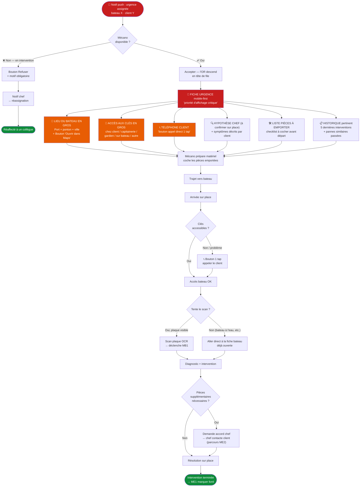

**📱 Layout type "Fiche urgence mécano" (mobile, plein soleil) :**

```
┌────────────────────────────────────────┐
│  🚨 URGENCE OR-0208                     │
│  Suzuki DF150 · Le Mistral             │
│  Pierre Martin                          │
├────────────────────────────────────────┤
│  📍  Port de La Trinité                 │
│     Ponton C · Place 42                 │
│     [🗺  Ouvrir Maps]                   │
├────────────────────────────────────────┤
│  🔑  Clés à la capitainerie             │
│     (M. Le Bras, demander OR-0208)      │
├────────────────────────────────────────┤
│  📞  06 12 34 56 78                     │
│     [📞 Appeler le client]              │
├────────────────────────────────────────┤
│  🔍  DIAGNOSTIC PRÉSUMÉ (chef)          │
│  Démarreur HS suspecté                  │
│  Symptômes client : "clac-clac"         │
│  pas de démarrage, batterie OK          │
├────────────────────────────────────────┤
│  🛠 PIÈCES À EMPORTER (à cocher)        │
│  ☐ Démarreur Suzuki DF150 (ref XY-12)   │
│  ☐ Bougies (jeu de 4)                   │
│  ☐ Multimètre                           │
│  ☐ Pince à sertir                       │
├────────────────────────────────────────┤
│  📋 HISTORIQUE                          │
│  ▼ Hivernage nov 2025 (Pierre)          │
│  ▼ Panne alternateur mars 2025          │
│  ▼ Entretien moteur sept 2024           │
└────────────────────────────────────────┘
[▶ JE PARS]   [⏸ ATTENDRE 5MIN]
```

### MB2 · Exécuter un OR planifié avec checklist (hivernage / déshivernage / sécurité / expertise)

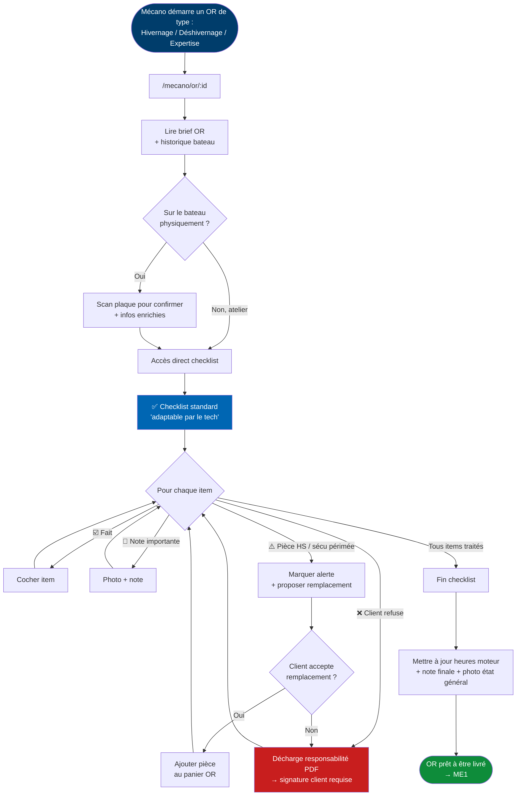

### ME1 · Marquer un OR comme livré

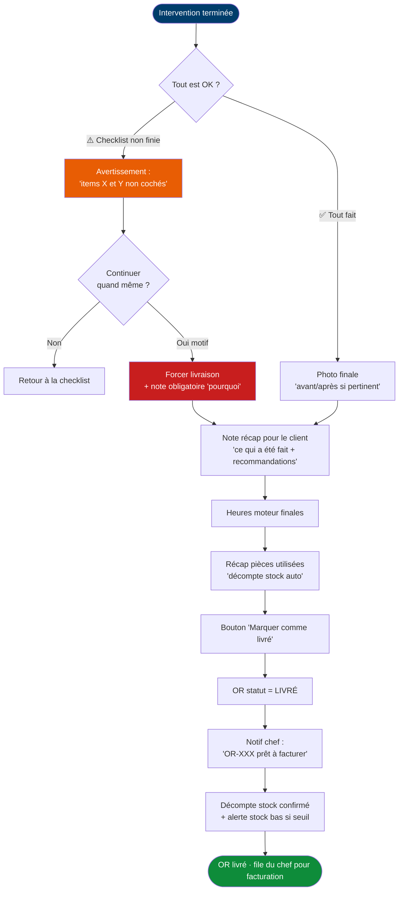

## 2.3 Les 11 autres parcours mécano à dérouler

### ☀️ Démarrage / changement d'état
- **MA1** · Filtrer son planning sur "aujourd'hui seulement" (action sur la page principale)
- **MA2** · Démarrer un OR (passage en statut "En réparation" + descend en tête du planning)

### 🔧 Pendant l'intervention
- **MC1** · Décompter une pièce utilisée (scan code-barre ou saisie)
- **MC2** · Ajouter notes / photos sur l'OR (hors checklist)
- **MC3** · Documenter une pose d'instrument (GPS, sondeur, VHF…)
- **MC4** · Cocher l'inventaire sécurité d'un bateau (hors hivernage)

### 🛡 Cas particuliers
- **MD1** · Constater un défaut sous garantie constructeur (photos + rapport)
- **MD2** · Réaliser une expertise occasion (checklist + rapport PDF)
- **MD3** · Recevoir un client au comptoir (chef indispo)

### ✅ En cours / sortie
- **ME2** · Demander accord client pour pièce supplémentaire (alerte chef)

### 👤 Personnel
- **MF1** · Voir son planning sur la semaine
- **MF2** · Voir ses stats perso (OR livrés, temps moyen)
- **MF3** · Mon profil / mot de passe

---

# 🧩 PARTIE 3 — Modèle de données (commun aux deux rôles)

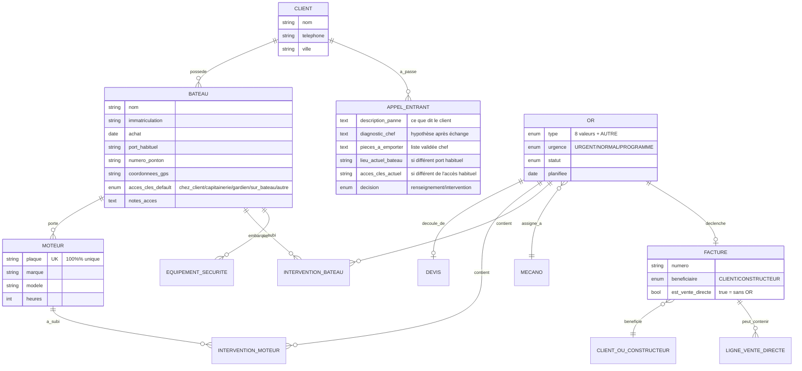

**Points clés :**
- La **plaque moteur** = clé d'unicité 100% (le moteur est l'identifiant pivot, pas le bateau)
- **1 client = N bateaux** (relation 1-N)
- **1 bateau = N moteurs** possibles (bi-moteur catamaran, hors-bord double)
- **1 moteur peut migrer** entre bateaux dans le temps (historique de pose à tracer)
- **Facture sans OR** possible (cas achat comptoir : vente directe)

---

## 🔧 Comment visualiser ce fichier ?

- **GitHub** : les diagrammes Mermaid sont rendus automatiquement. Va sur https://github.com/INF-IAGAILLARDROMAIN/nautilus/blob/main/docs/architecture/parcours-utilisateurs.md
- **VSCode** : ouvre le fichier, installe l'extension `Markdown Preview Mermaid Support` (Matt Bierner), puis `Cmd+Shift+V` pour la preview
- **Sortie PDF** : on pourra exporter le tout en PDF pour le Dossier de Projet jury (impression A3 conseillée pour les gros flowcharts)
