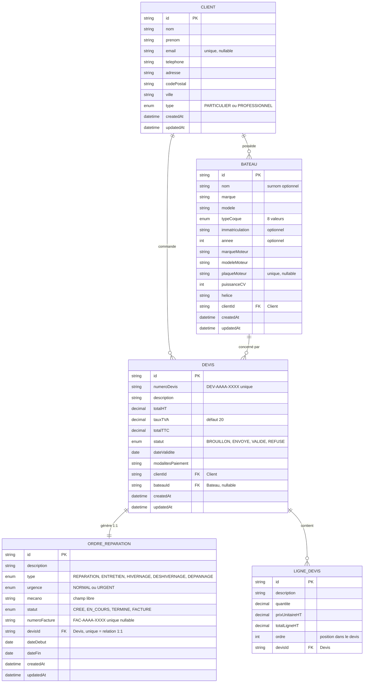
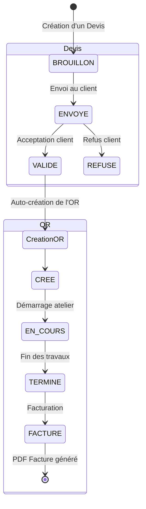

# MCD — Modèle Conceptuel de Données — Nautilus

> **Modèle Conceptuel de Données** de l'application Nautilus.
> 5 entités relationnelles + relations + cardinalités.

---

## 1️⃣ MCD principal (Mermaid)

Diagramme entité-relation à coller dans **Mermaid Live Editor** (https://mermaid.live) pour exporter en PNG/SVG haute résolution :

---

## 2️⃣ Explication des relations

| Relation | Cardinalité | Signification métier |
|---|---|---|
| **Client → Bateau** | 1 à N | Un client possède un ou plusieurs bateaux. Un bateau appartient à UN seul client. |
| **Client → Devis** | 1 à N | Un client peut avoir plusieurs devis. Chaque devis est associé à UN client. |
| **Bateau → Devis** | 1 à N (optionnel) | Un bateau peut avoir plusieurs devis. Un devis peut être lié à un bateau OU être un devis pré-vente sans bateau (`bateauId` nullable). |
| **Devis → LigneDevis** | 1 à N | Un devis contient une ou plusieurs lignes (vidange, pièces, main d'œuvre…). |
| **Devis → OrdreReparation** | 1 à 1 | Un devis validé génère exactement un OR (`devisId` unique sur OR). |
| **OrdreReparation → Facture** | — | La Facture n'est PAS une entité ; c'est un PDF généré à la volée à partir de l'OR (au statut FACTURE) + son Devis lié. Un numéro de facture séquentiel (`FAC-AAAA-XXXX`) est généré au passage au statut FACTURE. |

---

## 3️⃣ Workflow métier (état des entités)

---

## 4️⃣ Contraintes d'intégrité PostgreSQL

| Contrainte | Détail |
|---|---|
| **FK CASCADE** | `Bateau.clientId` → suppression du client efface ses bateaux |
| **FK RESTRICT** | `Devis.clientId` → impossible de supprimer un client ayant des devis |
| **FK RESTRICT** | `OrdreReparation.devisId` → impossible de supprimer un devis lié à un OR |
| **FK CASCADE** | `LigneDevis.devisId` → suppression du devis efface ses lignes |
| **UNIQUE** | `Client.email` (nullable) — un email = un client max |
| **UNIQUE** | `Bateau.plaqueMoteur` (nullable) — une plaque = un bateau max |
| **UNIQUE** | `Devis.numeroDevis` — pas de doublon de numéro de devis |
| **UNIQUE** | `OrdreReparation.devisId` — relation 1:1 stricte Devis ↔ OR |
| **UNIQUE** | `OrdreReparation.numeroFacture` (nullable) — pas de doublon de facture |

---

## 5️⃣ Index PostgreSQL pour la performance

| Index | Justification |
|---|---|
| `Client(nom, prenom)` | Recherche client par nom dans le moteur IA et la barre de recherche |
| `Bateau(clientId)` | Accès rapide à tous les bateaux d'un client (fiche client) |
| `Bateau(marqueMoteur)` | Recherche par marque moteur (intent `list_bateaux_by_moteur`) |
| `OrdreReparation(statut)` | Filtrage par statut (intent `list_or_by_statut`) |
| `OrdreReparation(mecano)` | Filtrage par mécano (V2) |

---

## 6️⃣ Comment exporter en image

### Option A — Mermaid Live Editor (recommandé)

1. Va sur **https://mermaid.live**
2. Colle le bloc Mermaid de la section 1 dans l'éditeur de gauche
3. Le rendu apparaît à droite
4. Bouton **"Actions" → "PNG"** ou **"SVG"** pour télécharger

### Option B — VSCode avec extension

1. Installe l'extension **"Markdown Preview Mermaid Support"**
2. Ouvre ce fichier .md dans VSCode
3. Cmd + Shift + V → tu vois le rendu directement
4. Capture la zone du diagramme

### Option C — Outil en ligne

- https://www.draw.io (importer depuis Mermaid)
- https://app.diagrams.net
