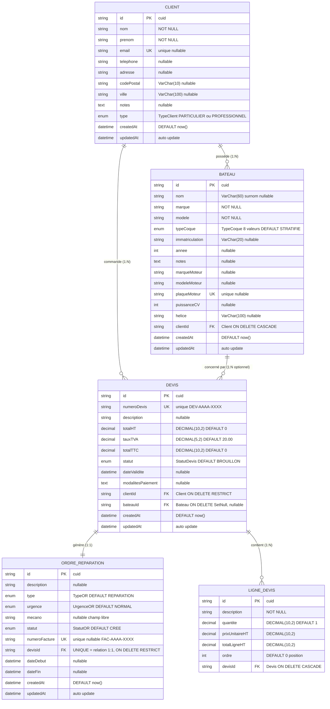
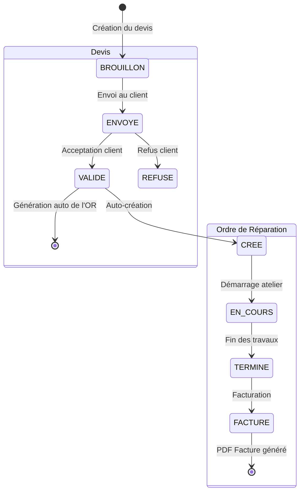

# MCD / MLD / MPD — Modèle de Données — Nautilus

> Documentation complète de la base de données Nautilus selon les 3 niveaux d'abstraction exigés par le référentiel TP DWWM :
> - **MCD** : Modèle Conceptuel de Données (entités + relations + cardinalités)
> - **MLD** : Modèle Logique de Données (transformation en tables avec FK)
> - **MPD** : Modèle Physique de Données (types SQL précis, contraintes, index)

---

## 1️⃣ MCD complet (Mermaid — à exporter en PNG via mermaid.live)



> 📌 **Note importante** : la **Facture** n'est PAS une entité séparée du modèle. C'est un PDF généré à la volée à partir de l'OR (quand son statut passe à FACTURE) + le Devis lié. Cette décision économise une table sans perte fonctionnelle.

---

## 2️⃣ Tableau des relations (cardinalités détaillées)

| Relation | Côté gauche | Côté droit | Sens métier |
|---|---|---|---|
| **Client → Bateau** | 1 (obligatoire) | 0..N | Un client peut posséder 0, 1 ou N bateaux ; un bateau a UN seul propriétaire |
| **Client → Devis** | 1 (obligatoire) | 0..N | Tous les devis ont un client référent (même pré-vente) |
| **Bateau → Devis** | 0..1 (optionnel) | 0..N | Un devis peut être SANS bateau (pré-vente / pièces génériques) — d'où `bateauId nullable` |
| **Devis → OR** | 1 (obligatoire) | 0..1 (relation 1:1 stricte) | Un OR est créé automatiquement quand le devis est VALIDÉ avec un bateau lié |
| **Devis → LigneDevis** | 1 (obligatoire) | 1..N | Un devis contient au moins une ligne (CASCADE à la suppression) |

---

## 3️⃣ Workflow métier (diagramme d'état)



---

## 4️⃣ MLD — Tableau des tables physiques PostgreSQL

| Table SQL | Modèle Prisma | Particularité |
|---|---|---|
| `Client` | `Client` | — |
| `Bateau` | `Bateau` | — |
| `Devis` | `Devis` | — |
| `LigneDevis` | `LigneDevis` | — |
| `ordre_reparation` | `OrdreReparation` | Renommé via `@@map` car `OR` est un mot-clé réservé Prisma (opérateur logique) |

---

## 5️⃣ MPD — Contraintes d'intégrité PostgreSQL

| Contrainte | Détail |
|---|---|
| **FK `Bateau.clientId`** | `ON DELETE CASCADE` — supprimer un client supprime ses bateaux |
| **FK `Devis.clientId`** | `ON DELETE RESTRICT` — impossible de supprimer un client ayant des devis |
| **FK `Devis.bateauId`** | `ON DELETE SetNull` — supprimer un bateau laisse les devis orphelins (ne casse pas l'historique) |
| **FK `LigneDevis.devisId`** | `ON DELETE CASCADE` — supprimer un devis supprime ses lignes |
| **FK `OrdreReparation.devisId`** | `ON DELETE RESTRICT` — impossible de supprimer un devis lié à un OR |
| **UNIQUE `Client.email`** | Nullable mais unique — un email = un client max |
| **UNIQUE `Bateau.plaqueMoteur`** | Nullable mais unique — plusieurs NULL acceptés par PostgreSQL |
| **UNIQUE `Devis.numeroDevis`** | Pas de doublon de numéro de devis |
| **UNIQUE `OrdreReparation.devisId`** | Relation 1:1 stricte Devis ↔ OR |
| **UNIQUE `OrdreReparation.numeroFacture`** | Nullable, généré au passage au statut FACTURE |

---

## 6️⃣ MPD — Index pour la performance des requêtes

| Index | Table | Justification métier |
|---|---|---|
| `idx_client_nom_prenom` | `Client(nom, prenom)` | Recherche par nom (barre IA + recherche manuelle) |
| `idx_bateau_clientId` | `Bateau(clientId)` | Accès aux bateaux d'un client (fiche client) |
| `idx_bateau_marque_modele` | `Bateau(marque, modele)` | Recherche par marque/modèle de coque |
| `idx_bateau_marqueMoteur` | `Bateau(marqueMoteur)` | Intent IA `list_bateaux_by_moteur` |
| `idx_devis_clientId` | `Devis(clientId)` | Liste devis d'un client |
| `idx_devis_bateauId` | `Devis(bateauId)` | Liste devis d'un bateau |
| `idx_devis_statut` | `Devis(statut)` | Filtrage par statut (BROUILLON, VALIDE…) |
| `idx_lignedevis_devisId` | `LigneDevis(devisId)` | Récupération des lignes d'un devis |
| `idx_or_statut` | `ordre_reparation(statut)` | Filtrage par statut (intent `list_or_by_statut`) |
| `idx_or_mecano` | `ordre_reparation(mecano)` | Filtrage par mécano (V2 multi-utilisateurs) |

---

## 7️⃣ Énumérations utilisées (types PostgreSQL)

```sql
TypeClient    : PARTICULIER, PROFESSIONNEL                              (2 valeurs)
StatutDevis   : BROUILLON, ENVOYE, VALIDE, REFUSE                       (4 valeurs)
TypeOR        : ENTRETIEN, REPARATION, HIVERNAGE, DESHIVERNAGE, DEPANNAGE (5 valeurs)
UrgenceOR     : NORMAL, URGENT                                          (2 valeurs)
StatutOR      : CREE, EN_COURS, TERMINE, FACTURE                        (4 valeurs)
TypeCoque     : STRATIFIE, ALUMINIUM, POLYETHYLENE, SEMI_RIGIDE,
                PNEUMATIQUE, BOIS, ACIER, AUTRE                         (8 valeurs)
```

---

## 8️⃣ Statistiques du modèle

| Élément | Compte |
|---|---|
| Tables physiques | **5** |
| Énumérations | **6** |
| Clés primaires (PK) | **5** (toutes en `cuid()`) |
| Clés étrangères (FK) | **5** |
| Contraintes UNIQUE | **5** |
| Index | **10** |
| Attributs au total | **~65** |

---

## 9️⃣ Documents liés

- 📄 **Schéma Prisma complet** : [`schema-prisma-complet.md`](schema-prisma-complet.md) — source de vérité versionnée Git
- 📄 **Script SQL de création** : [`migration-sql.md`](migration-sql.md) — SQL natif PostgreSQL généré par Prisma
- 🖼 **Image PNG** : [`mcd-nautilus.png`](mcd-nautilus.png) — export Mermaid haute résolution
- 🖼 **Image SVG** : [`mcd-nautilus.svg`](mcd-nautilus.svg) — vectoriel pour zoom infini

---

## 🔟 Comment regénérer le MCD en image

1. Va sur **https://mermaid.live**
2. Efface le contenu de l'éditeur de gauche
3. Colle le bloc Mermaid de la **section 1** ci-dessus
4. Le rendu apparaît à droite
5. En bas à gauche, déplie **"Actions"**
6. Saisis `Width: 2400` (haute résolution)
7. Clique sur **"PNG"** ou **"SVG"** → téléchargement
